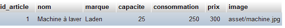
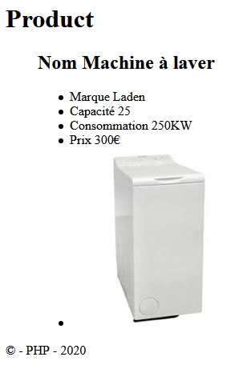

# &lt; / &gt;Communication client serveur : SQL, PHP

Nous allons mettre en place la communication client serveur, par la création d'une base de données **product** et d'une table **articles**.

## Création de la table 

```php
    id_article,     type=int
    nom, 		type=varchar
    marque, 		type=varchar
    capacite,	type=int
    consommation,	type=int
    prix, type=int
    image, type=varchar
```

## insertion des données



## Connection php pour la base de donnée par l'objet **PDO**
```php
 //selectionner la base
    try{// On se connecte à MySQL
    $pdo_options[PDO::ATTR_ERRMODE] = PDO::ERRMODE_EXCEPTION;
    $bdd = new PDO('mysql:host=localhost;dbname=product', 'root', '', array(PDO::MYSQL_ATTR_INIT_COMMAND => 'SET NAMES utf8',$pdo_options));
    
    // On récupère tout le contenu   
    $reponse = $bdd->query('SELECT * FROM `articles` WHERE 1');
    
    // On affiche chaque entrée une à une
    while ($donnee = $reponse->fetch()){
    echo '<h2>Nom '.$donnee['nom'].'</h2>
        <figcaption>
            <ul>
                <li>Marque '.$donnee['marque'].'</li>
                <li>Capacité '.$donnee['capacite'].'</li>
                <li>Consommation '.$donnee['consommation'].'KW</li>
                <li>Prix '.$donnee['prix'].'&euro;</li>
                <li></li>

            </ul>
        </figcaption>';
         

     
      // echo "<pre>".print_r($donnee)."</pre>";
       }
    $reponse->closeCursor(); // Termine le traitement de la requête

    }
    //partie finale
    catch(Exception $e){
    // En cas d'erreur précédemment, on affiche un message et on arrête tout
    die('Erreur : '.$e->getMessage());
    }
```
## Attention :
 Si vous êtes sur **MAMP** le code initiale sera : 

```php
    $bdd = new PDO('mysql:host=localhost;dbname=product', 'root', 'root', array(PDO::MYSQL_ATTR_INIT_COMMAND => 'SET NAMES utf8',$pdo_options));
```
## Résultat final dans le navigateur :




